# Review Branch  
Can be merged with branch "Assignment_3" after approval.  
  
# HARTFORD_ASSIGNMENT3_SUDSM_AWS  
Assignment 3 as part of Hartford AWS SageMaker Assignment  
  
## Goal:  
Create training model using sagemaker's own xgboost model.   
    
## Procedure:    
    
### Create the required code    
  - The code is built on top of Assignment 2's code which handles pre-processing of data  
  - Therefore, many files in this branch would be common to Assignment 2.  
      - The only file of interest for assignment 3 is "xgboost_inbuilt_Assignment3.ipynb" at:  
        - Notebooks/inbuilt-sagemaker-model/xgboost_inbuilt_updated.ipynb  
  
### Steps  
  
  - The inbuilt XGBoost model is used. Before training the model, the debug paths, experiments are setup.  
  - XGBoost model is trained using the below hyperparameters:  
    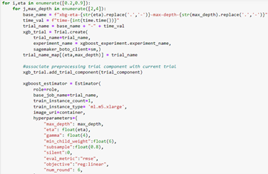  
  - The hyper-parameter runs are associated with the sagemaker experiments and "train:rmse","validation:rmse" are logged.  
  - Once the training is completed, the below charts are created from Sagemaker experiment:  
    - num_round vs train:rmse  
      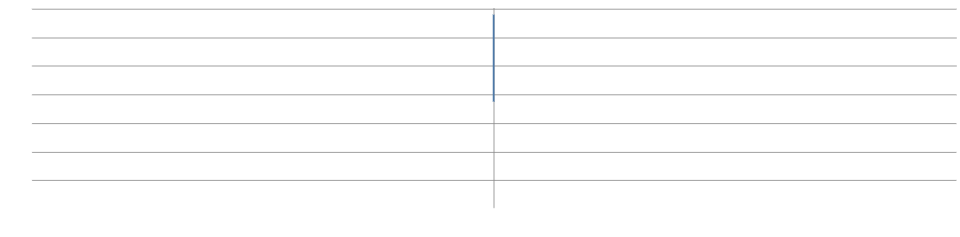  
    - num_round vs validation:rmse  
      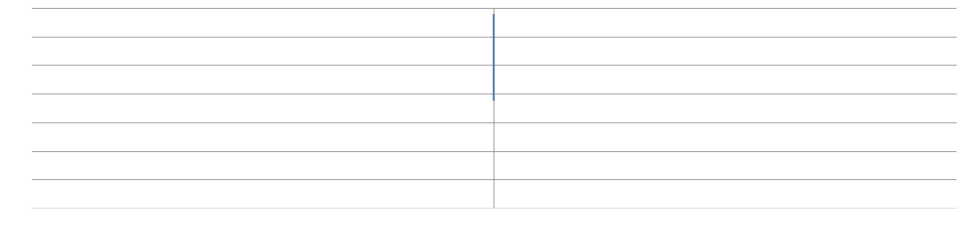  
    - gamma vs train:rmse  
      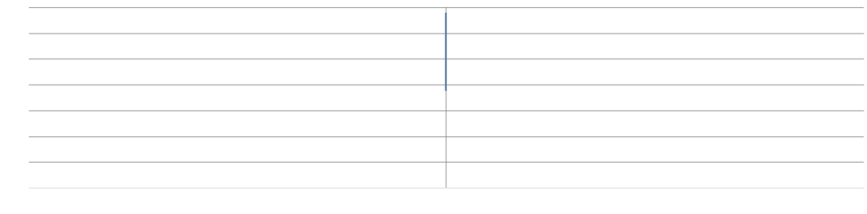  
    - gamma vs validation:rmse  
      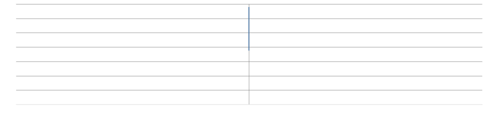  
    - eta vs train:rmse  
      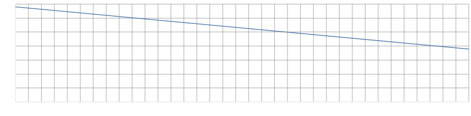  
    - eta vs validation:rmse  
      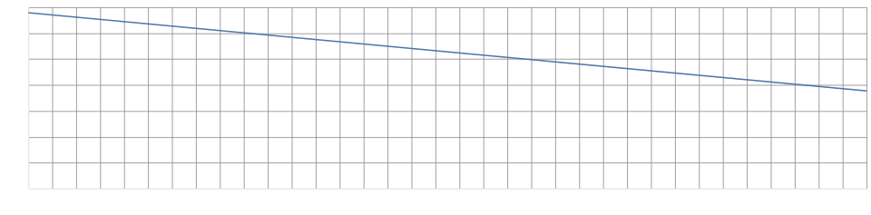  
    - max_depth vs train:rmse  
      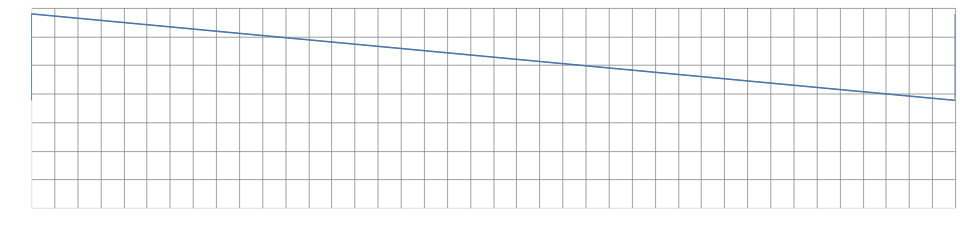  
    - max_depth vs validation:rmse  
      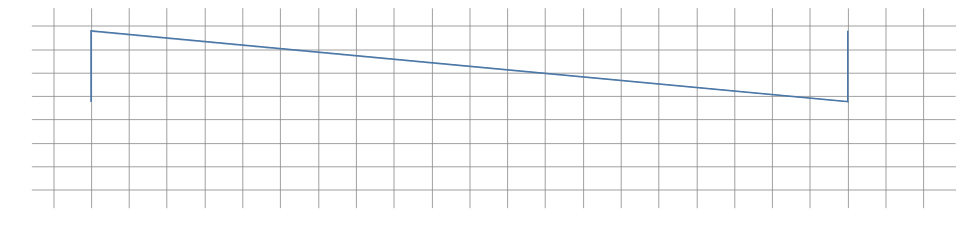  
  - The best model is selected based on rmse score  
      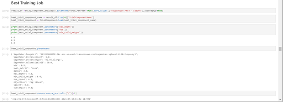  
  - For the selected best model, debugger is configured again   
    - with "loss_not_decreasing" and "overfit" debugger rules  
    - To collect SHAP and feature values for the best model  
      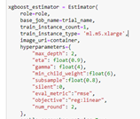  
      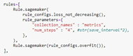  
  - The best model is visualized and below plots are made  
    - Metrics vs num_rounds/Iteration   
        
    - Feature-Importance (Weight and Cover) vs num_rounds/Iteration  
      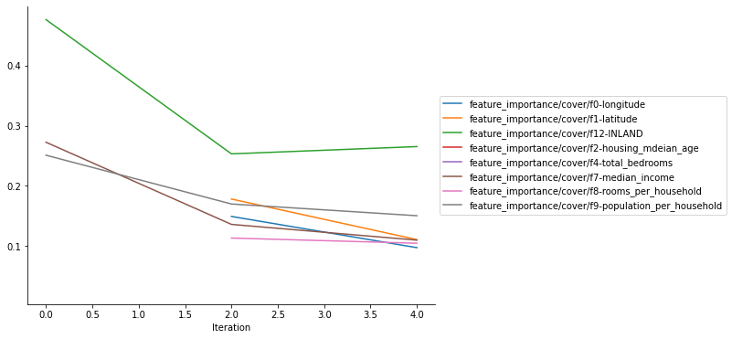  
    - Average-SHAP values vs num_rounds/Iteration  
      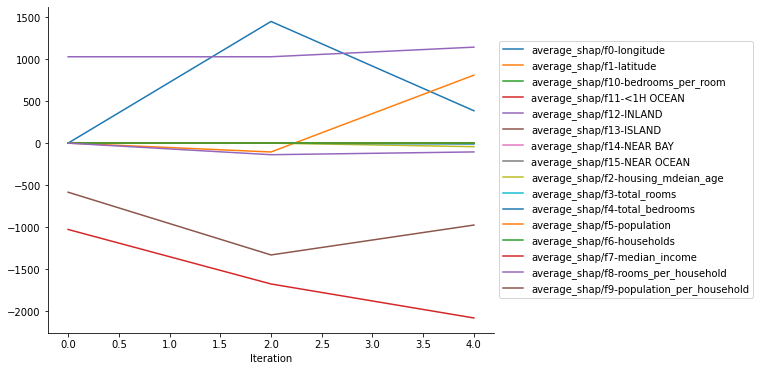  
    - Global Explanations  
      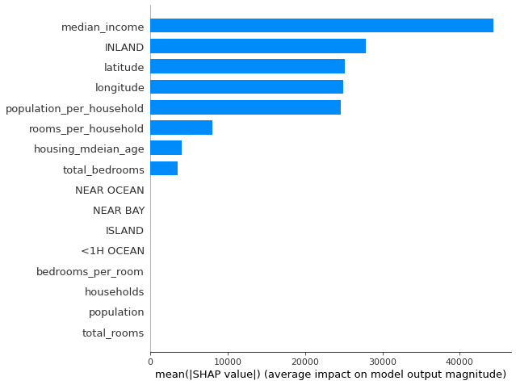  
    - Local Explanations  
      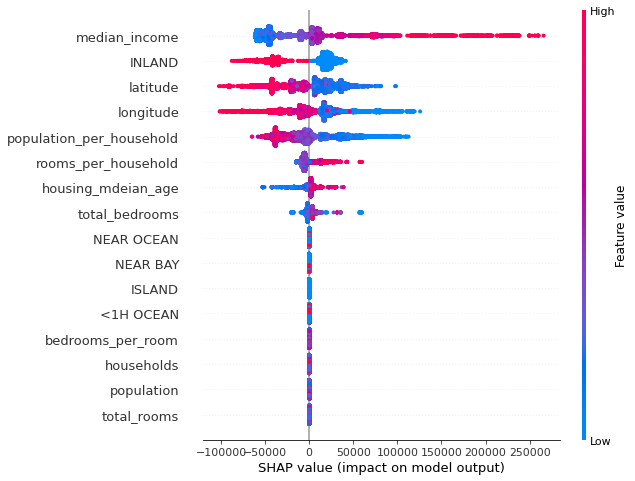  
      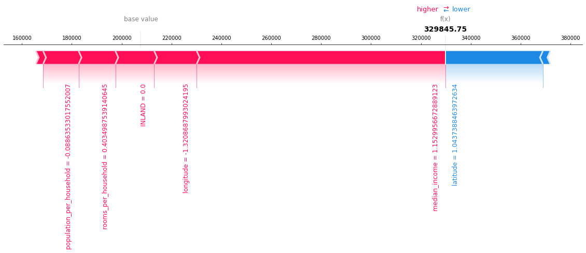  
    - Stacked Force Plot  
       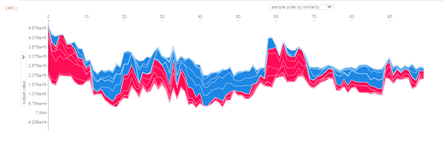    
    - Outlier Plots  
      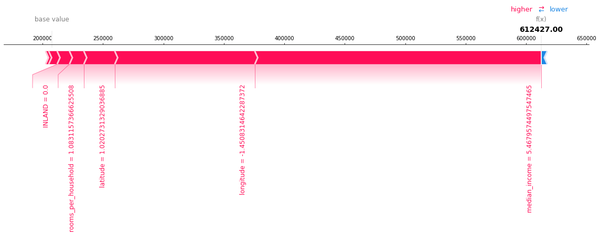  
      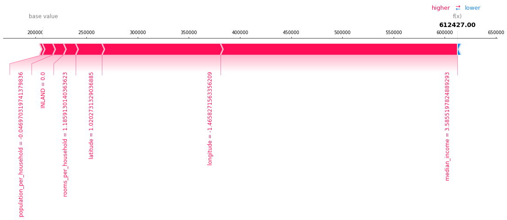  
      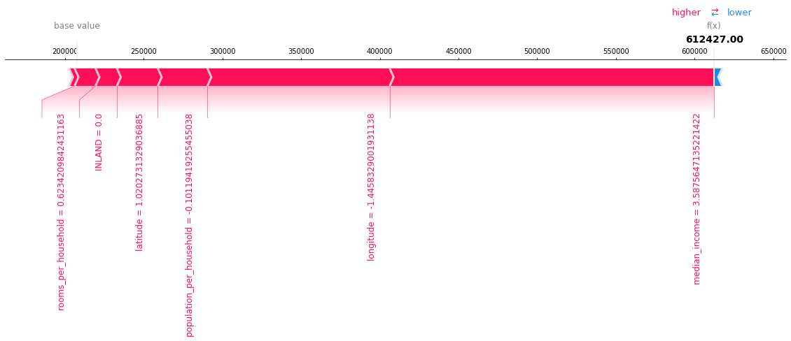  
      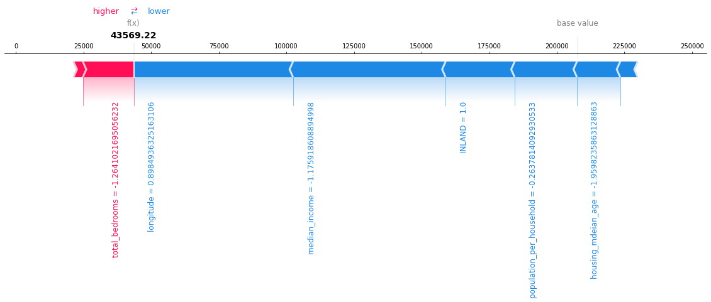  
      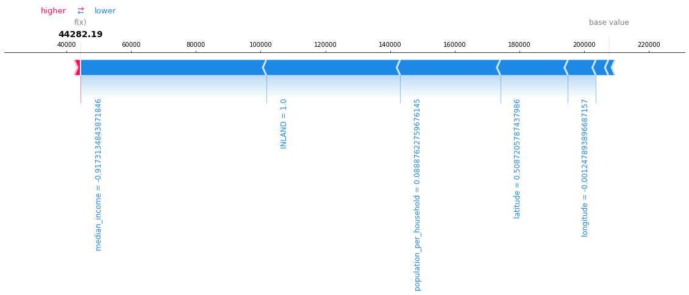  
      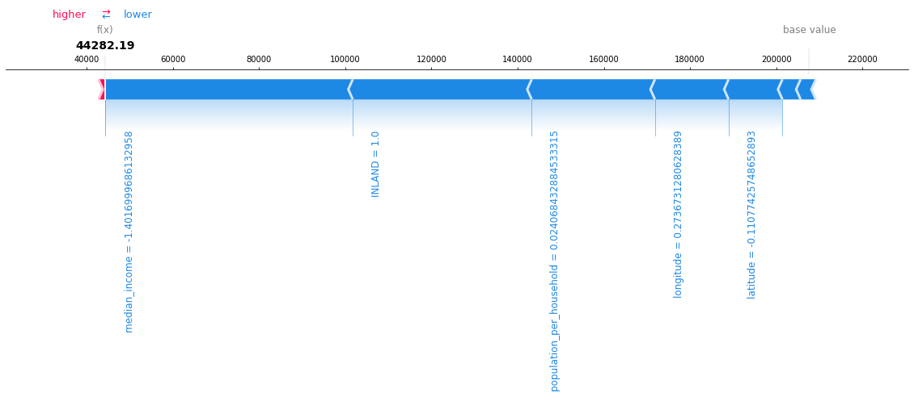  
  - The built model is deployed using sagemaker endpoint 
      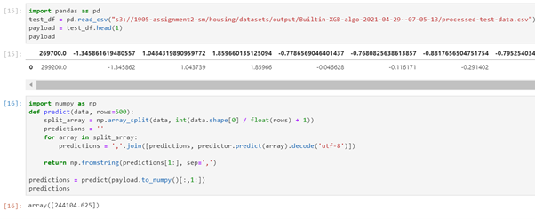    
  
### Other information:  
  
- Sagemaker Experiment Screenshots  
  - 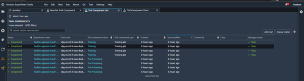  
  - 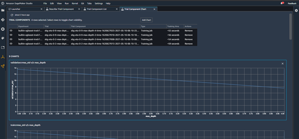  
  - 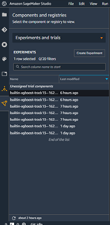   
  
- Billing information (will be updated post 24hrs once)  
  - 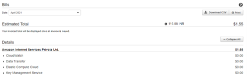  
  - 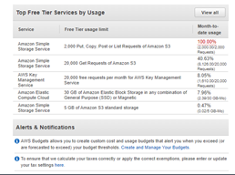  
  - 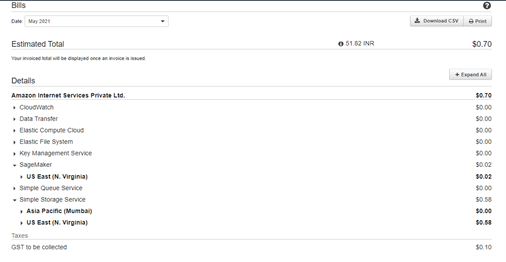  
   
