# Review Branch  
Once the assignment is reviewed,can be merged with Assignment2 branch  
  
# HARTFORD_ASSIGNMENT2_SUDSM_AWS  
Assignment 2 as part of Hartford AWS SageMaker Assignment  
  
## Goal:  
Use sagemaker to preprocess housing data.  
  
## Procedure:  
  
### Create the required code  
  - The data needs to be split into train and test  
  - A SKLearn pipeline needs to be defined that takes in the data, does preprocessing and saves the output  
  - The below structure is followed for the codes:  
         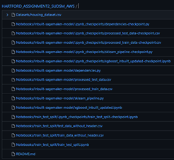  
  - The "Datasets" folder has the raw data for reference.  
  - The Notebooks folder has 2 subfolders:  
       - train_test_split : contains the code to split raw data to train and test. The train and test data are also saved here.  
       - inbuilt-sagemaker-model: This folder has the below files  
            - xgboost_inbuilt_updated.ipynb: The main code to preprocess the train and test data  
            - sklearn_pipeline.py: This code specifies the SkLearn pipeline for preprocessing  
            - dependencies.py: The dependency script for sklearn_pipeline.py  
            - processed_train_data.csv: The final train data after preprocessing  
            - processed_test_data.csv: The final test data after preprocessing  
  - f. This is the entire code structure required for preprocessing  
    
### Set-up AWS for preprocessing  
  - Create a new S3 bucket and store the input data:  
       - Create a new S3 bucket named "1905-assignment2-sm". Enable versioning and add tags. Created in "us-east-1"  
       - Upload the raw housing dataset into this bucket. This file will be sent for train-test-split.  
          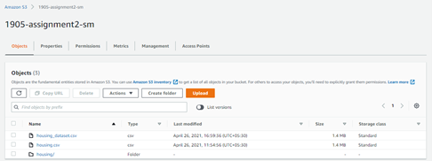  
       - Create a notebook instance in "us-east-1" in "ml.m4.xlarge" instance. Add an IAM role with access to Sagemaker and S3 while creating.  
         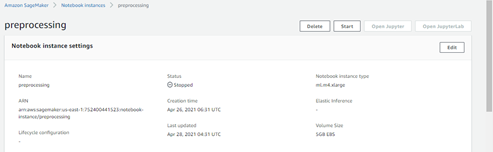  
           
### Deploying the code in local machine  
We will first deploy the code from our local machine before running it on SageMaker Notebook instance. This is done as follows:  
  - The "xgboost_inbuilt_updated.ipynb" needs to be changed a little bit to deploy it in local machine.   
  - Make the following changes in "xgboost_inbuilt_updated.ipynb"  
    - Change "role = get_execution_role()" and mention the role name directly. For eg, "role = 'role_name_here'".  
  - Open the Ubuntu terminal in your local machine and follow the below steps to preprocess:  
    - Setup the Git environment by cloning into the branch.  
    - Open a python virtual environment  
    - Install necessary packages (sagemaker, pandas, s3fs, fsspec)  
    - Configure aws using your access key and access ID  
    - Run the "train_test_split.ipynb" notebook using "runipy". This will create the train and test datasets in the s3 bucket as shown.  
        
    - Run the "xgboost_inbuilt_updated.ipynb". This will create processing task, training job and batch transform job.  
      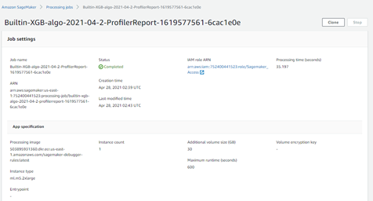  
      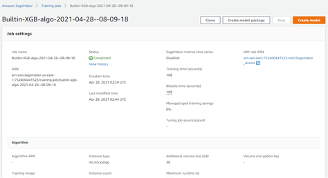  
      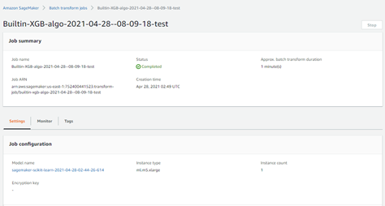  
    - The preprocessed data will be placed in the S3 bucket as shown below.  
      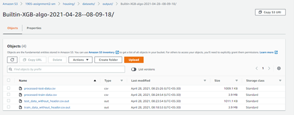  
    - Finally, push these changes to the github repository.  
        
### Deploying in Sagemaker Notebook instance  
  - Start the Notebook Instance we had created and open JupyterLab  
  - Clone into the GitHub repositry's "main" branch  
  - Run the "train_test_split.ipynb" folowed by "xgboost_inbuilt_updated.ipynb". Similar to the local run, the relevant jobs will be created this time too.  
     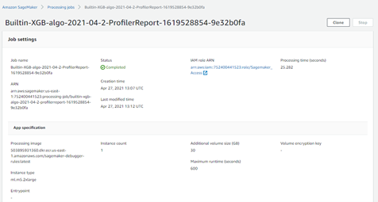  
     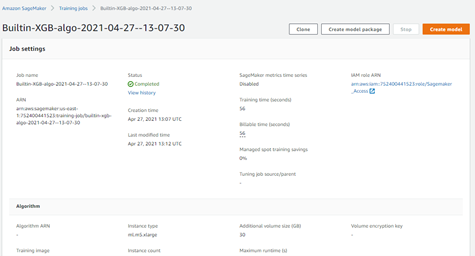  
     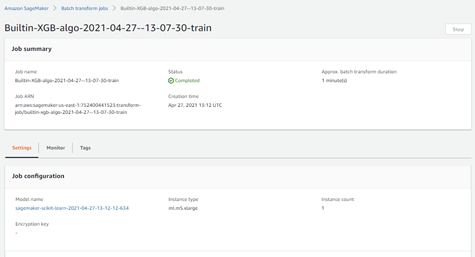  
     All batch trasnform jobs (training, testing for local and sagemaker runs)  
     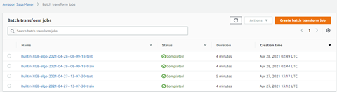  
  -   The preprocessed data will be stored in S3 as shown during local deployment  
    
### Real time Transformation  
  - Previously, we performed batch transform wherein we gave a predefined set od datapoints as inputs.   
  - In real-time transform, we will invoke an endpoint and deploy our preprocessor in it.   
  - By doing this we will be able to input a set of data points and get the processed outputs in real time. The below snippets show the same.  
    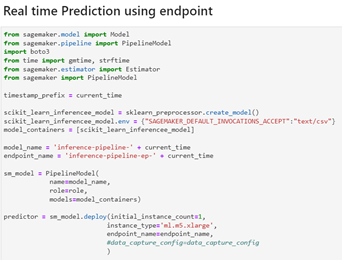  
    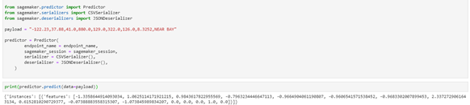  
    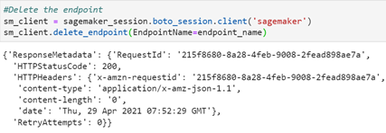  
        
### Output Files  
The preprocessed output files are kept in "Datasets" folder for reference.  
        
### Billing information (will be updated after 24 hours)  
    
    
    
    
  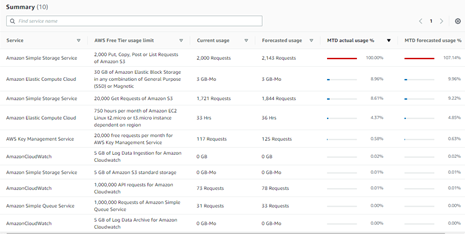  
