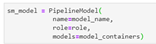
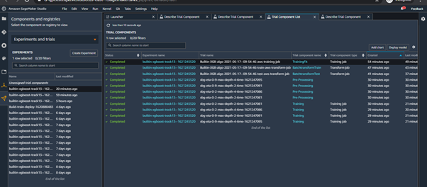
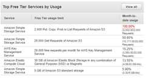

# Review Brach  
This branch can be merged with "Assignment_4" once the PR is approved.  
  
# HARTFORD_ASSIGNMENT4_SUDSM_AWS  
Assignment 4 as part of Hartford AWS SageMaker Assignment  
  
## Goal:  
Logging each step of the model building process and deploying the final model in an end-point.     
    
## Procedure:    
    
### Create the required code    
  - The code is built on top of Assignment 3's code.  
    - This code already uses experiment to track the training of the data.  
    - Therefore, we just modify the code to include pre-processing(fit, batchtransform) logs into the experiment.  
    - By doing so, we can track all the steps in model-building end-end.  
  
### Modifications to code:  
  - Logging the train data fit process.    
        
  - Logging the batch transformation of train data.  
        
  - Logging the batch transformation of test data.  
      
  - Rest of the code remains almost same. The trials are logged and the best model is chosen. The best model is then analyzed before deploying the endpoint.   
      
  - The Pre-processing and XGBoost model are put into a pipeline as shown below.  
      
      
  - An endpoint is deployed using the pipeline.  
      
      
  - Predictions from the endpoint.   
      
  - Many files in this branch would be common to Assignment 3.    
      - The only file of interest for assignment 4 is "xgboost_inbuilt_updated.ipynb" at:  
        - Notebooks/inbuilt-sagemaker-model/xgboost_inbuilt_updated.ipynb  
  - The sagemaker studio showing all trials we created  
      
     
   
### Other information:  
    
- Billing information (will be updated post 24hrs once)  
  -   
  -   
  -   
